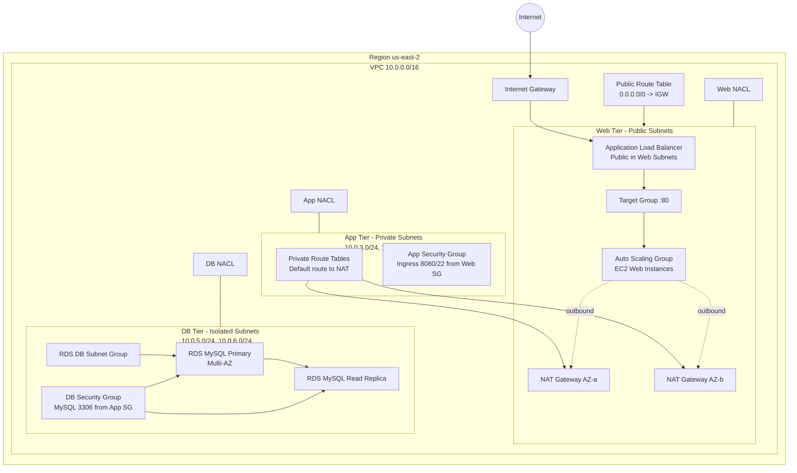

# 3-Tier AWS Infrastructure (Terraform)

This stack provisions a 3-tier network and compute/database layout in AWS (`us-east-2`) using reusable Terraform modules.

## Simplified Architecture

```mermaid
flowchart LR
    Internet((Internet)) --> IGW[Internet Gateway]
    IGW --> ALB[Application Load Balancer\n(Public Web Subnets)]
    ALB --> ASG[Auto Scaling Group\nEC2 Web Instances]

    ASG --> AppTier[Private App Tier\n(Subnets + SG/NACL)]
    AppTier --> DBPrimary[(RDS MySQL Primary)]
    DBPrimary --> DBReplica[(RDS MySQL Read Replica)]

    NAT[NAT Gateways] --> AppTier
```

## Detailed Architecture



## Current Terraform Modules

- `vpc-module`
- `subnet-module`
- `igw-module`
- `nat-gw-module`
- `routetable-module`
- `nacl-module`
- `security-group-module`
- `app-alb-module`
- `app-asg-module`
- `rds-module`

## Notes

- Web route table points to IGW for public ingress/egress.
- Private app routes use NAT gateways for outbound-only internet access.
- RDS instances run in DB subnets via DB subnet group and are not publicly accessible.
